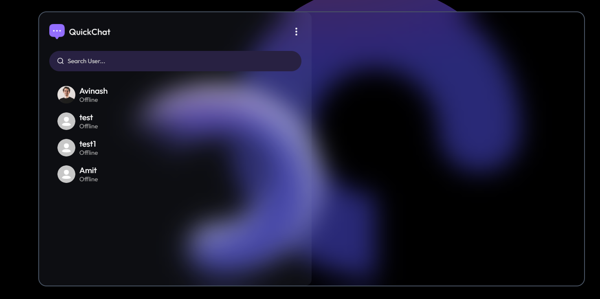
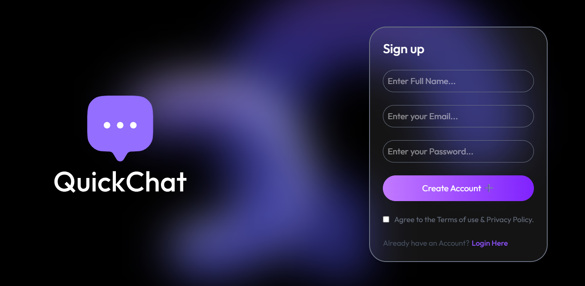
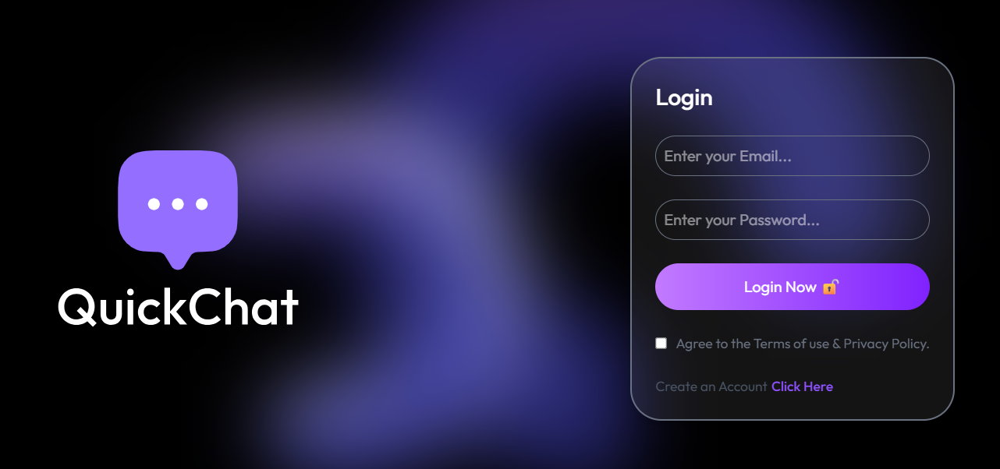
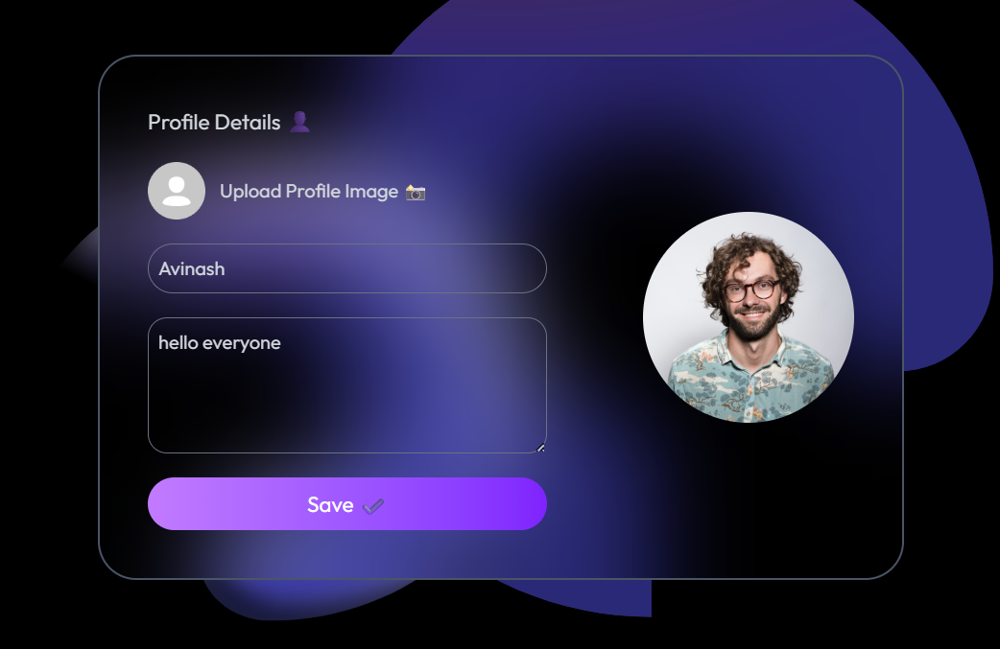

# 🌟 QuickChat - MERN Stack Real-Time Messaging App

> 🚀 **Welcome to QuickChat**
>
> A **modern real-time messaging application** built using the **MERN Stack** and **Socket.IO**.  
>     

> Connect with friends, family, and colleagues instantly through a **feature-rich, responsive, and secure chat interface**.

---

## 🔥 Features

- Real-time one-to-one and group messaging
- Online/offline status & typing indicators
- Message read receipts and notifications
- Secure authentication with JWT & encrypted passwords
- Modular and scalable architecture for future extensions

---

## 🛠 Tech Stack

### Frontend

| React.js                                                                                           | Axios                                                                                              | Socket.IO-client                                                                                                 | React Router                                                                                                            |
| -------------------------------------------------------------------------------------------------- | -------------------------------------------------------------------------------------------------- | ---------------------------------------------------------------------------------------------------------------- | ----------------------------------------------------------------------------------------------------------------------- |
|  |  |  |  |

---

### Backend

| Node.js                                                                                                    | Express.js                                                                                                  | Socket.IO                                                                                                        | JWT                                                                                                      | Bcrypt.js                                                                                              |
| ---------------------------------------------------------------------------------------------------------- | ----------------------------------------------------------------------------------------------------------- | ---------------------------------------------------------------------------------------------------------------- | -------------------------------------------------------------------------------------------------------- | ------------------------------------------------------------------------------------------------------ |
|  |  |  |  |  |

---

### Database

| MongoDB                                                                                                  | Mongoose                                                                                                    |
| -------------------------------------------------------------------------------------------------------- | ----------------------------------------------------------------------------------------------------------- |
|  |  |

---

---

## 📸 Screenshots

A visual walkthrough of **QuickChat** showing the core pages and features. Replace the paths below with your local image paths.

### 🏠 Home Page

The landing page provides an intuitive chat interface, showing active conversations, online contacts, and recent messages in real-time.

---

### 📝 Sign Up Page

A simple and secure registration page allowing users to create an account with email and password, using JWT authentication and encrypted passwords.

---

### 🔐 Login Page

A secure login interface enabling users to access their account and chat in real-time with safe authentication.

---

### 👤 Profile Page

Manage user information, update your profile picture, and customize settings for a seamless chat experience.

---

## 🌐 Live Website

Check out QuickChat online and start chatting instantly!

**[Visit QuickChat](https://qchatty.vercel.app/login)** 🚀

---

## 🔗 Connect & Feedback

I’d love to hear your feedback! Open an issue or contact me for suggestions and collaboration.

---
